# Recipe Book

I love to cook and share food with loved ones. I am a very forgetful person!

Have you ever made a delicious meal but forget to write down the process and all of the ingredients used? Or been at a dinner party and asked the host for a recipe of theirs (after a couple of glasses of red) and completely forgotten it? This is a problem I have encountered plenty of times so I figured others must be the same.

The problems outlined above serve as my inspiration to create 'Recipe Book'. As a site owner, my ultimate goal is to create a community for lovers of cooking where people can record & share their own recipes and view & share the recipes of their friends and others. I want Recipe Book to be a user-friendly site that makes it easy to quickly record your favourite homemade recipes in case you ever lose your grandmother's old, handwritten recipe book.

## Design

### Wire Frames

It was my intention to keep the design as simple as possible. Initially, the only views I envisaged were for recipe list and recipe creation. I have included wireframes for iphone and desktop for each below

- Recipe List Wireframes

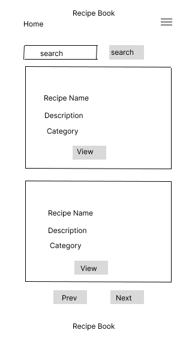
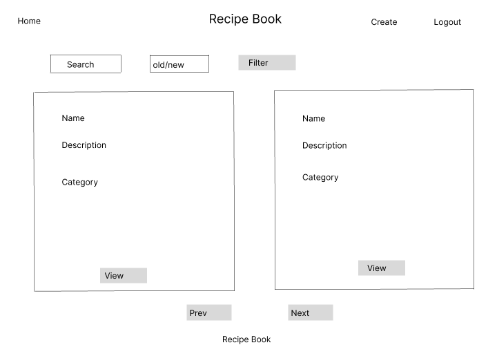
- Create Recipe Wireframes

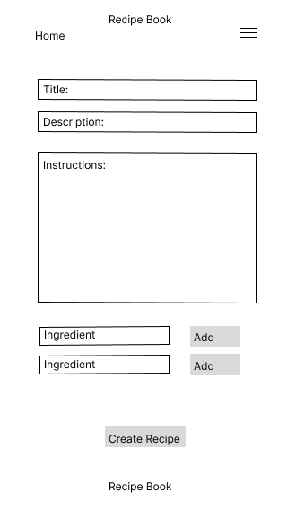
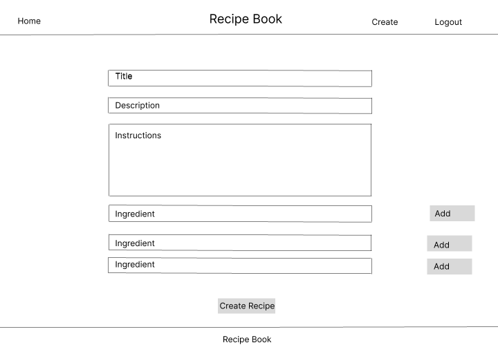

## Models

The creation of my wireframes provided a basis for the site's models. During the planning process I sought guidance from my mentor on how to associate multiple ingredients to each recipe. The use of intermediate models and the 'through' parameter facilitates this. In addition to the models listed below, I have used Django's default user model.

__Category__

This model is used to categorise recipes.
- Fields
  - 'name': A character field with a maximum length of 100 characters to store the category name.
- Mehtods
  - '_str_': Returns the name of the category as its string representation.

__Ingredient__

This model represents ingredients used in recipes.
- Fields
  - 'name': A character field with a maximum length of 100 characters to store the ingredient name.
- Methods
  - '_str_': Returns the name of the ingredient as its string representation.

__Recipe__

This model represents recipes and their associated details.
- Fields
  - 'title': A character field with a maximum length of 200 characters for the recipe title.
  - 'description':A character field with a maximum length of 100 characters for a brief description of the recipe.
  - 'instructions': A text field to store detailed instructions for the recipe.
  - 'user': A foreign key to the User model, indicating the user who created the recipe. If the user is deleted, all their recipes will also be deleted.
  - 'categories': A many-to-many relationship with the Category model through the RecipeCategory model, allowing a recipe to be associated with multiple categories.
  - 'ingredients': A many-to-many relationship with the Ingredient model through the RecipeIngredient model, allowing a recipe to include multiple ingredients.
  - 'created_on': A date-time field that automatically records when the recipe is created.
  - 'status': An integer field with predefined choices (defined by STATUS) to indicate the recipe's status, with a default value of 0.
- Mehtods
  - '_str_': Returns the name of the recipe as its string representation.

__RecipeIngredient__

This model serves as an intermediary to manage the many-to-many relationship between recipes and ingredients, including the quantity of each ingredient used in a recipe.
- Fields
  - 'recipe': A foreign key to the Recipe model, linking the ingredient to a specific recipe. If the recipe is deleted, the associated RecipeIngredient records will also be deleted.
  - 'ingredient': A foreign key to the Ingredient model, linking the ingredient to a specific recipe. If the ingredient is deleted, the associated RecipeIngredient records will also be deleted.
  - 'qunatity': A character field with a maximum length of 100 characters to specify the quantity of the ingredient used in the recipe.

__RecipeCategory__

This model serves as an intermediary to manage the many-to-many relationship between recipes and categories.
- Fields
  - 'recipe': A foreign key to the Recipe model, linking the recipe to a specific category. If the recipe is deleted, the associated RecipeCategory records will also be deleted.
  - 'category': A foreign key to the Category model, linking the recipe to a specific category. If the category is deleted, the associated RecipeCategory records will also be deleted. 

__Model ERDs__

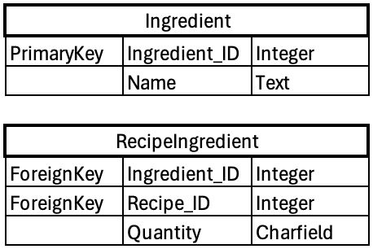
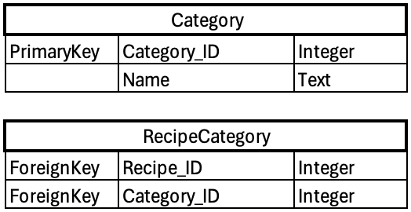
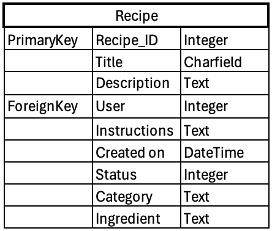

## Forms

__RecipeForm__

- Defines a form for the 'Recipe' model
- Meta class:
  - model: Specifies the model this form is associated with (Recipe).
  - fields: Specifies the fields to include in the form (title, description, instructions, status).

__RecipeIngredientForm__

- Defines a form for the 'RecipeIngredient' model.
- Meta class:
  - model: Specifies the model this form is associated with (RecipeIngredient).
  - fields: Specifies the fields to include in the form (ingredient, quantity).
- init method:
  - Calls the parent class's __init__ method to initialize the form.
  - Orders the ingredient queryset alphabetically by name for the dropdown selection.

__RecipeCategoryForm__

- Defines a form for the 'RecipeCategory' model.
- Meta class: 
  - model: Specifies the model this form is associated with (RecipeCategory).
  - fields: Specifies the field to include in the form (category).

__RecipeIngredientFormSet__

- Creates an inline formset for managing RecipeIngredient instances related to a Recipe.
- Parameters:
  - Recipe: The parent model.
  - RecipeIngredient: The child model.
  - form: The form class to use for the formset (RecipeIngredientForm).
  - extra: The number of extra empty forms to display (1 in this case).
  - can_delete: Allows the forms in the formset to be deleted.

## Views

The views collectively manage the functionality for viewing, creating, editing, and deleting recipes within the Django application, ensuring that only authenticated users can perform certain actions.

__RecipeList__

- A class-based view which displays a paginated list of recipes.
- Custom queryset: filters recipes based on category, sort order and search query.
- Context data: adds all categories, sort order and search query to the context for use in the recipe_list template.

__recipe_detail__

- A function-based view which displays the details of a specific recipe.
- Object retrieval: fetches the recipe by primary key or raises a 404 error if not found

__create_recipe__

- a function-based view with login required, which allows logged-in users to create a new recipe.
- Form-handling: handles form submission and validation for recipe creation, including ingredients and category.
- Success Message: Displays a success message upon successful creation.
- Redirection: Redirects to the detail view of the newly created recipe.

__edit_recipe__

- a function-based view with login required, which allows logged-in users to edit an existing recipe of their own creation.
- Object Retrieval: Fetches the recipe by primary key (pk) and ensures it belongs to the current user.
- Form Handling: Handles form submission and validation for recipe updates.
- Success Message: Displays a success message upon successful update.
- Redirection: Redirects to the detail view of the updated recipe.

__delete_recipe__

- a function-based view with login required which allows logged in users to delete an existing recipe of their own creation.
- Object Retrieval: Fetches the recipe by primary key (pk) and ensures it belongs to the current user.
- Confirmation: Displays a confirmation page before deleting the recipe.
- Success Message: Displays a success message upon successful deletion.
- Redirection: Redirects to the home page after deletion.

## Templates / Functionality

__base.html__

This template serves as a foundational layout for the site. It includes a header with navigation, a footer with social media links, and a main content area where specific pages will inject their content. It also handles user authentication states and displays messages using Bootstrap styling.

- Header and Navigation
  - Display of site title and Navbar
  - Navigation links which adjust based on user authentication state. If anonymous, user can see links for 'Home', 'Register' and 'Login'. If logged in the user can see links for 'Home', 'Create Recipe', 'Logout' and a welcome message.

- Header large screen

- Header small screen

- Header welcome message for logged in user

- Header anonymous user

- Main Content
  - Messages are displayed here using Bootstrap alerts (e.g., success, error notifications)
  - Content block which will be filled by child templates.

- Footer 
  - Footer containing social media links and false copyright information.

- Footer

__recipe_list.html__

This template is used to display the list of recipes with filtering, sorting, and search functionalities. It extends the base template to maintain a consistent look and feel. The main content area includes a form for filtering recipes, a list of recipe cards, and pagination controls to navigate through the list of recipes.

- Filter Form:
  - Category Dropdown: Allows users to select a category to filter recipes.
  - Sort by Dropdown: Allows users to sort recipes by newest or oldest.
  - Search Input: Allows users to search recipes by title or description.

- Recipe List:
  - Displays a list of recipes using Bootstrap cards. Each recipe card includes: Title, Description, Status, Categories, Created date, and Link to view the full recipe details.

- Pagination controls:
  - pagination buttons if the recipe list is paginated, allowing users to navigate between pages of recipes.

- Recipe List small screen

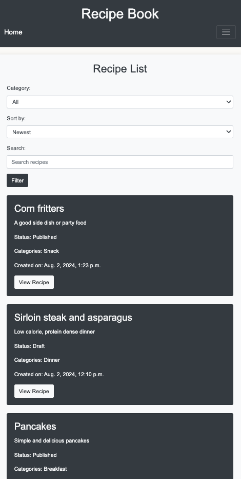

- Recipe List large screen

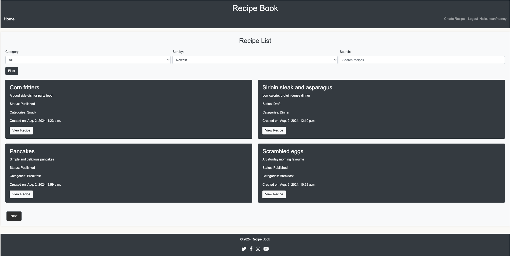

__recipe_detail.html__

This template is used to display the details of a specific recipe. It extends the base template for consistency and includes sections for the recipe's title, description, instructions, ingredients, categories, and status. If the logged-in user is the owner of the recipe, they are given options to edit or delete the recipe. The use of Bootstrap classes ensures the content is styled appropriately.

- Recipe detail card displays the recipe title inside a Bootstrap card with a dark background and light text.
- Description shows the description of the recipe.
- Instructions displays the recipe instructions. The | safe filter is used to render the instructions as HTML, allowing for any HTML content in the instructions to be correctly displayed.
- Ingredients section lists the ingredients for the recipe, showing each ingredient's name and quantity.
- Category lists the category the recipe belongs to.
- Status shows the status of the recipe using the get_status_display method to display the human-readable version of the status.
- "Edit Recipe" and "Delete Recipe" buttons if the current user is the owner of the recipe, allowing them to edit or delete the recipe.

- Recipe Detail small screen

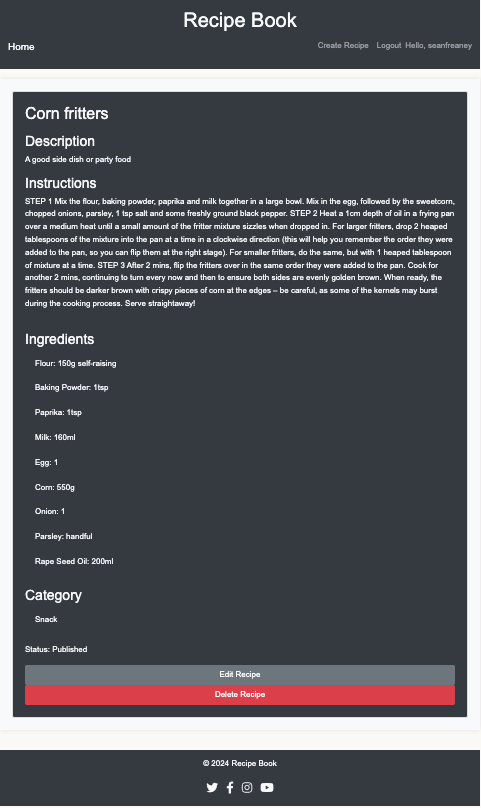

- Recipe Detail large screen

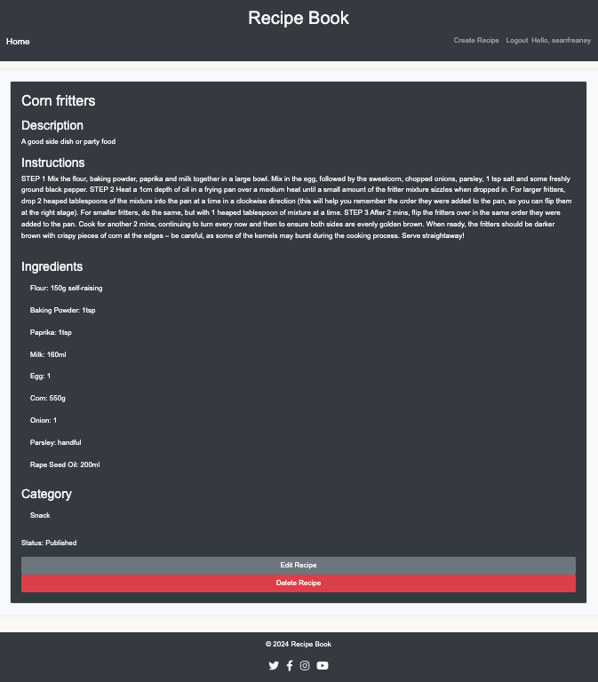

- Recipe Detail anonymous user

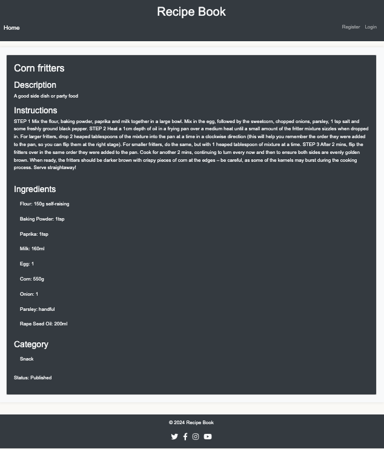

__create_recipe.html__

This template provides the structure for creating a new recipe, including forms for recipe details, categories, and ingredients. It checks if the user is authenticated before displaying the form, prompting login otherwise. The template leverages Django's form handling to render forms and includes JavaScript for enhanced functionality like adding more ingredient forms dynamically. The layout and design are consistent with the rest of the site, using Bootstrap for styling.

- Display for a form to create a new recipe:
  - Title and Description: Using recipe_form.
  - Category: Using category_form.
  - Ingredients: Using ingredient_formset, which allows multiple ingredient forms.
  - CSRF Token: Ensures security for the form submission.
  - Add Ingredient Button: A button to dynamically add more ingredient forms using JavaScript.
  - Create recipe submits the form to create recipe

- javascript dymanic functionality detailed below

- Create recipe small screen

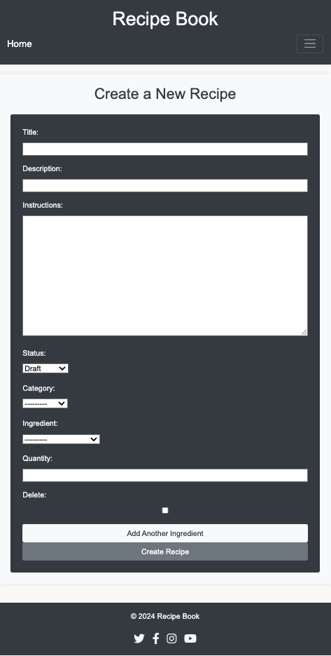

- Create recipe large screen

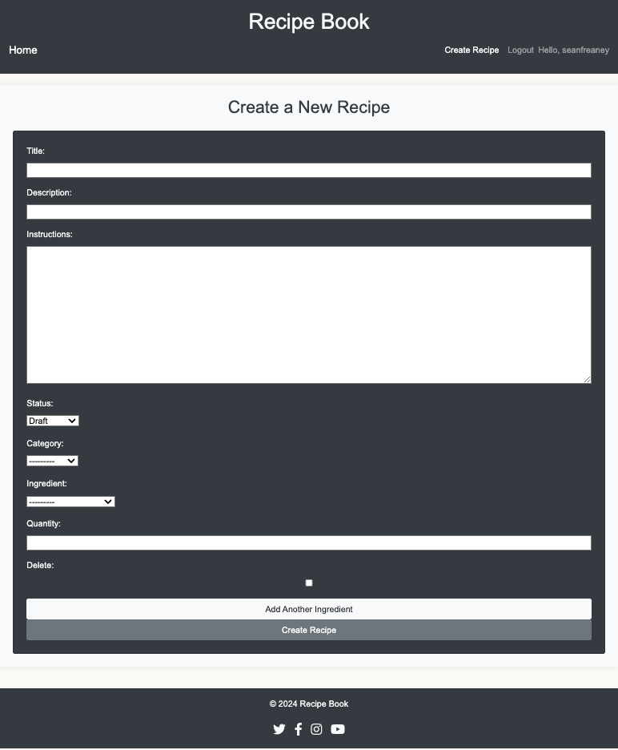

- Create recipe success message

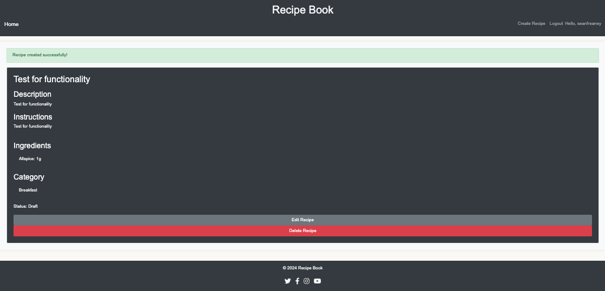

__edit_recipe.html__

This template provides the structure for editing an existing recipe, including forms for recipe details, categories, and ingredients. It checks if the user is authenticated before displaying the form, prompting login otherwise. The template leverages Django's form handling to render forms and includes JavaScript for enhanced functionality like adding more ingredient forms dynamically. The layout and design are consistent with the rest of the site, using Bootstrap for styling.

- Display for a form to edit and existing recipe:
  - Title and Description: Using recipe_form.
  - Category: Using category_form.
  - Ingredients: Using ingredient_formset, which allows multiple ingredient forms.
  - CSRF Token: Ensures security for the form submission.
  - Add Ingredient Button: A button to dynamically add more ingredient forms using JavaScript.
  - Update button: Submits the form to update the recipe.

- javascript dymanic functionality detailed below

- Edit Recipe small screen

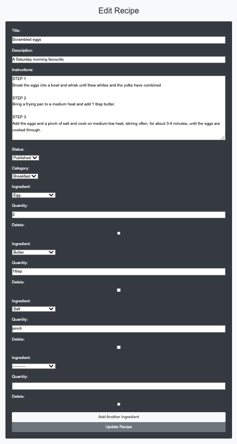

- Edit Recipe large screen

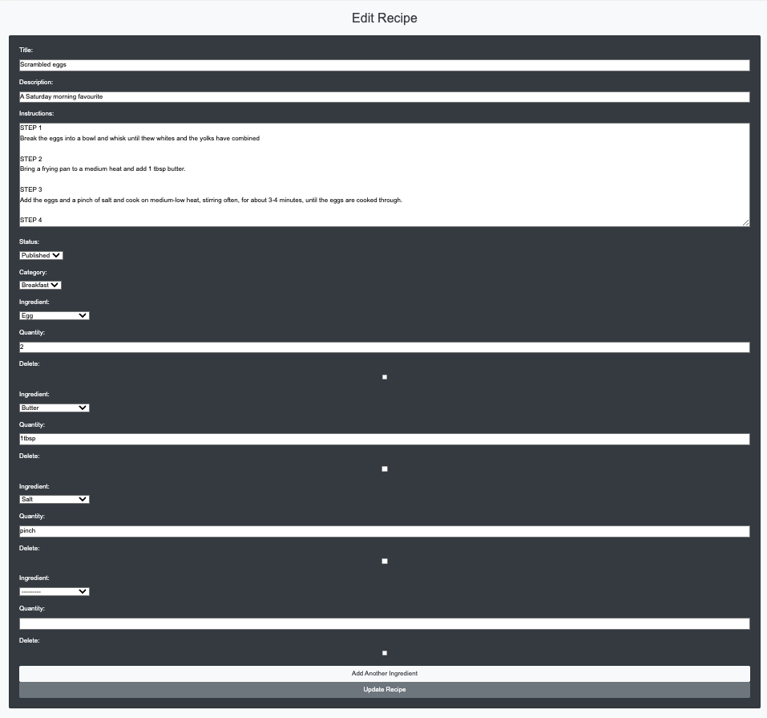

- Edit recipe success message

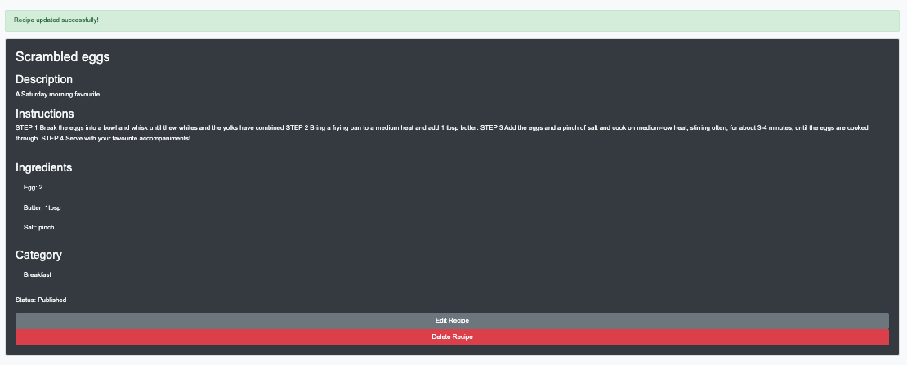

__confirm_delete.html__

This template provides a confirmation prompt for deleting a recipe. It extends the base template for consistent styling and layout, sets an appropriate page title, and includes a form for the user to either confirm or cancel the deletion. The design ensures the user is aware of the action they are about to take and provides a secure and user-friendly way to handle recipe deletions.

- Message displayed asking the user to confirm if they want to delete the specified recipe.
- Forms Submission: A form that submits a POST request to confirm the deletion. This includes:
  - CSRF Token: Ensures security for the form submission.
  - Delete Button: A button to submit the form and confirm deletion, styled with a red "btn-danger" class.
  - Cancel Button: A link to cancel the deletion and return to the recipe detail page, styled with a gray "btn-secondary" class.

- Delete recipe 

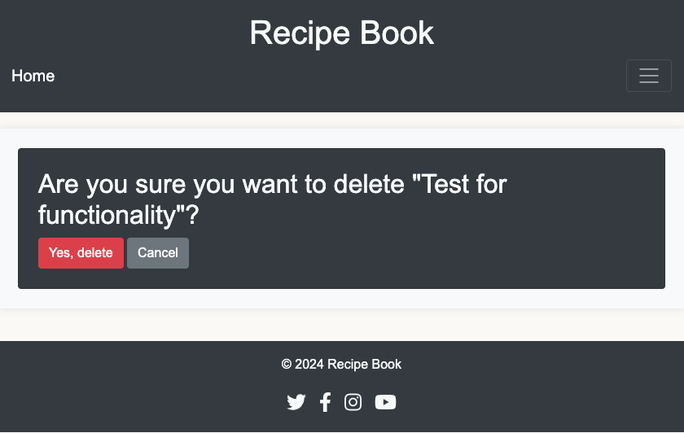

- Delete recipe success message

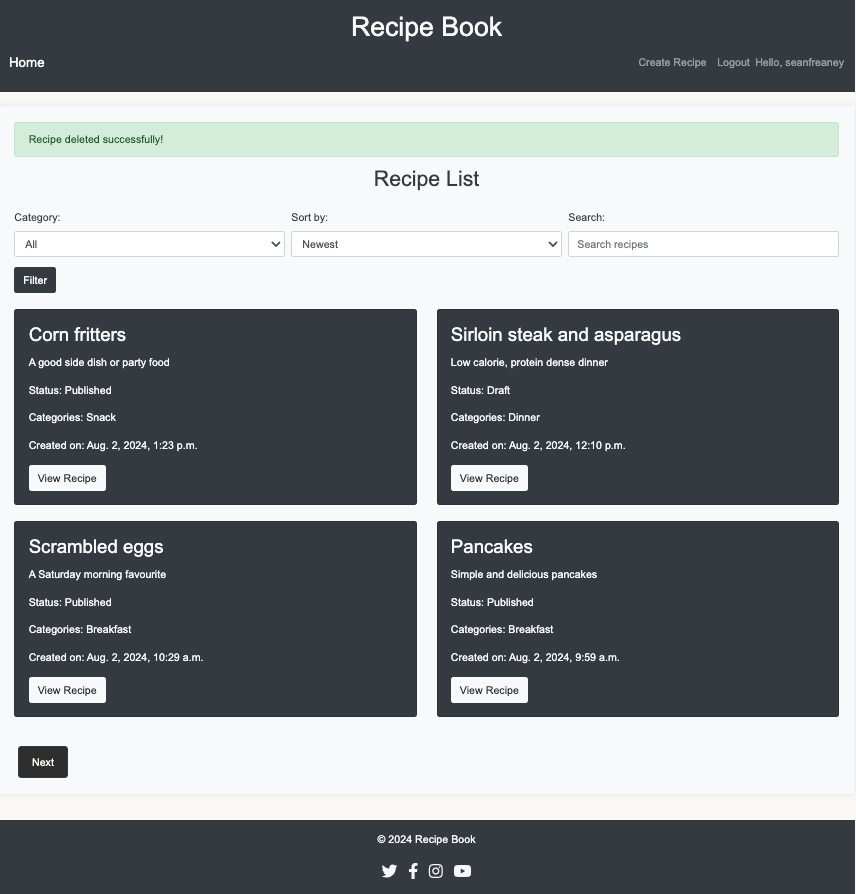

__Javascript__

Custom script which allows users to dynamically add new ingredient forms to a formset on the edit and create recipe views. When the user clicks the "Add Ingredient" button, a new form is created by cloning the first form in the set, updating its attributes to ensure uniqueness, clearing its values, and appending it to the formset.

- Event Listener for DOMContentLoaded:
   - document.addEventListener('DOMContentLoaded', function() {
    // Code here runs after the DOM is fully loaded });
 - This event listener waits for the entire HTML document to be fully loaded and parsed before executing the enclosed function. This ensures that all the DOM elements are available for manipulation.

- Select DOM Elements:
 - const addIngredientBtn = document.getElementById('add-ingredient-btn');
     - addIngredientBtn: Selects the button with the ID add-ingredient-btn which will be used to add new ingredient forms.
  - const ingredientFormset = document.querySelector('#ingredient-forms');
     - ingredientFormset: Selects the container with the ID ingredient-forms which holds the ingredient forms.
 - const totalFormsInput = document.querySelector('#id_recipeingredient_set-TOTAL_FORMS');
     - totalFormsInput: Selects the input element with the ID id_recipeingredient_set-TOTAL_FORMS, which tracks the total number of forms.

- Initial Form Count:
  - let formNum = ingredientFormset.children.length;
    - formNum: Initializes a counter to keep track of the number of existing forms. It is set to the number of children within the ingredientFormset container.

- Add Event Listener to Button:
  - addIngredientBtn.addEventListener('click', 
    function() {
    // Code here runs when the add button is clicked
    });
    - Adds a click event listener to the addIngredientBtn button. When the button is clicked, the enclosed function executes.

- Clone and Append a New Form:
  - if (ingredientFormset.children.length > 0) {
    const newForm = ingredientFormset.children[0].cloneNode(true);
    const formRegex = new RegExp(`recipeingredient_set-(\\d+)-`, 'g');
    const newFormNum = formNum;
    - Checks if there is at least one form already present in the ingredientFormset.
    - Clones the first form (index 0) inside ingredientFormset, including all its child elements, and assigns it to newForm.
    - formRegex is a regular expression that matches the pattern recipeingredient_set- followed by any digits (the current form number).
    - newFormNum is assigned the current value of formNum.

- Update the Cloned Form's Attributes
  - newForm.innerHTML = newForm.innerHTML.replace(formRegex, `recipeingredient_set-${newFormNum}-`);
    - Replaces all occurrences of the pattern recipeingredient_set- followed by digits in the innerHTML of the cloned form with recipeingredient_set- followed by the new form number. This ensures that the form fields have unique names and IDs.
  
  - newForm.querySelectorAll('[id]').forEach(function   (element) {
    const newId = element.id.replace(formRegex, `recipeingredient_set-${newFormNum}-`);
    element.id = newId;
    });
    - Finds all elements in the cloned form that have an id attribute and Updates each id attribute to use the new form number, ensuring uniqueness.
  
  - newForm.querySelectorAll('[name]').forEach(function(element) {
    const newName = element.name.replace(formRegex, `recipeingredient_set-${newFormNum}-`);
    element.name = newName;
    });
    - Finds all elements in the cloned form that have a name attribute and updates each id attribute to use the new form number, ensuring uniqueness.

- Clear Values in Cloned Form
  - newForm.querySelectorAll('input, select, textarea').forEach(function(element) {
    if (element.type === 'checkbox' || element.type === 'radio') {
        element.checked = false;
        } else {
        element.value = '';
        }
      });
      - Selects all input, select, and textarea elements within the cloned form and clears their values. If the element is a checkbox, it unchecks it.

- Append the Cloned Form and Update Total Forms
  - ingredientFormset.appendChild(newForm);
    formNum++;
    totalFormsInput.value = formNum;
    - Appends the cloned and modified form (newForm) to the ingredientFormset. Increments the formNum counter. Updates the value of the totalFormsInput to reflect the new total number of forms.

__Authentication__

I have used the python allauth package to facilitate user authentication for users. In future iterations of the site I will implement email and social media sign in. I have used some customer CSS to style the sign in and sign up screens to match the style of the site. I have also included messages to alert of successful registration/sign in.

- Registration / Sign up

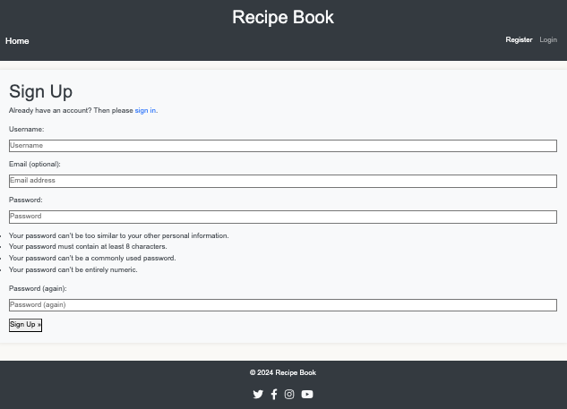

- Sign in

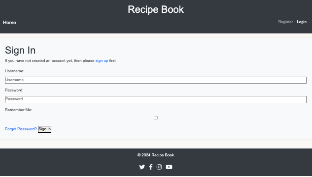

- Sign out

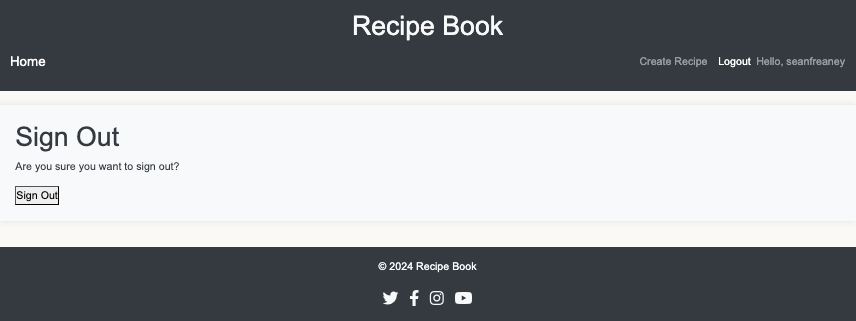

- Registration / Sign up and Sign in successful message

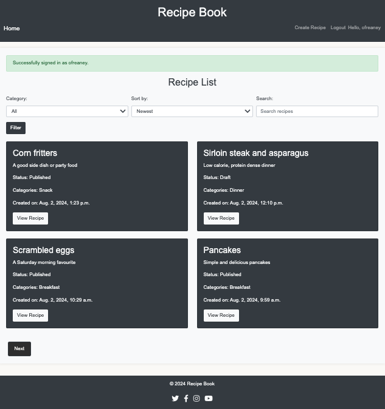

- Sign out successful message

__Site Admin Interface__

I have used Django's admin module for the site admin interface. Inline models are used to display and edit related objects.

- RecipeIngredientInline: Defines how RecipeIngredient objects are edited inline within the Recipe admin page.
- RecipeCategoryInline: Defines how RecipeCategory objects are edited inline within the Recipe admin page.
- RecipeAdmin:
  - inlines: Specifies the inline models (RecipeIngredientInline, RecipeCategoryInline) to be included in the Recipe admin page.
  - list_display: Fields to display in the list view of the Recipe objects in the admin interface.
  - search_fields: Fields to include in the search functionality.
  - list_filter: Adds a filter sidebar for the status field.

__Media Queries__

I have used media queries to ensure that the user's view is appropriate to the device which they are using.

### Additional features to be added

- Implement dynamic removal of recipe ingredients. Currently the user has to select the delete checkbox to remove an ingredient. This functionality is working but it is not the best user experience.
- Implement a quantities model to put structure and conformity on how quantities are added to recipe ingredients.
- Improve ingredient selection: currently you select ingredients from a dropdown. I would like to streamline this to split ingredients by type (meat, fish, pultry, pork, vegetables, herbs & spices) allowing the user to more easily find their desired ingredients.
- Provide a form for users to notify site admin of missing ingredients to be added to the database.
- Allow user to add their own ingredients: I would like to allow users to add their own ingredients. Currently the scope of the ingredients in quite restrictive. This will be changed in a future iteration.
- Increase / create community:
  - Create user profiles so that users can view their own recipes and recipes of others using the site.
  - Implement a comment model so users can comment on their own recipes and pther recipes.

## Testing

### Automated Testing

__Form Tests__

- RecipeFormTest: 
  - test_valid_recipe_form: Tests a valid recipe form with data in all required fields.
  - test_invalid_recipe_form: Tests if recipe form is invalid when required data is missing.
  - test_recipe_form_fields: Verifies that the RecipeForm includes all the necessary fields

- RecipeIngredientFormTest:
  - test_valid_ingredient_form: Checks if the RecipeIngredientForm is valid with correct data.
  - test_invalid_ingredient_form: Checks if the RecipeIngredientForm is invalid when required data is missing.
  - test_ingredient_queryset: Verifies that the ingredient field's queryset is correctly set to include all ingredients, ordered by name.

- RecipeCategoryFormTest:
  - test_valid_category_form: Checks if the RecipeCategoryForm is valid with correct data.
  - test_invalid_category_form: Checks if the RecipeCategoryForm is invalid when required data is missing.

__Views Tests__

- RecipeDetailViewTests:
  - test_recipe_detail_view_with_published_recipe: Verifies that the detail view of a published recipe is correctly rendered.

- RecipeListViewTests:
  - test_recipe_list_view_pagination: Tests that the recipe list view supports pagination.
  - test_recipe_list_view_filter_by_category: Tests that recipes can be filtered by category.
  - test_recipe_list_view_sort_by_newest: Tests that recipes can be sorted by newest first.
  - test_recipe_list_view_sort_by_oldest: Tests that recipes can be sorted by oldest first.
  - test_recipe_list_view_search: Tests that recipes can be searched by title or description.

- CreateRecipeViewTests:
  - test_create_recipe_view_get: Tests that the create recipe view is rendered correctly.

### Manual Testing Table

| Action    | Expectation | Result | 
| ---------|:-------------------:|----------|
| Click 'Home' link | directed to Recipe List | Pass |
| Click 'Register' link | directed to Sign Up | Pass |
| Click 'Login' link | directed to Sign In | Pass |
| Register an account, providing correct details | directed to Recipe List, success message displayed | Pass/Pass |
| Register an account, leaving Username black | prompted to input details | Pass |
| Register an account, leaving password black | prompted to input details | Pass |
| Register an account, leaving password (again) black | prompted to input details | Pass |
| Login, providing corect details | directed to Recipe List, success message displayed | Pass |
| Login, leaving Username black | prompted to input details | Pass |
| Login, leaving Password black | prompted to input details | Pass |
| Click 'Forgot Password' | directed to forgot password page | Pass |
| Input email for 'Forgot Password' | receive message indicating email sent | Pass/although this is an **unfixed bug** |
| Click 'Create Recipe' | directed to create recipe view | Pass |
| Click 'Add Another Ingredient' in create recipe view | ingredient form added | Pass |
| Click 'Delete' in create recipe view ingredient form | ingredient removed after clicking 'Create Recipe' | Pass |
| Click 'View Recipe' in Recipe List | directed to recipe detail | Pass |
| Click 'Next' in Recipe List | directed to next Recipe List page | Pass |
| Click 'Prev' in Recipe List | directed to previous Recipe List page | Pass |
| Click 'Edit Recipe' in Recipe Detail | directed to edit recipe view | Pass |
| Click 'Edit Recipe' in Recipe Detail | directed to edit recipe view | Pass |
| Click 'Delete Recipe' in Recipe Detail | directed to delete recipe view | Pass |
| Click 'Yes, delete' in delete recipe view | redirected to recipe list/success message displayed | Pass |
| Click 'Cancel' in delete recipe view | redirected to recipe detail | Pass |
| Click social media icons in Footer | redirected to relevant social media homepage | Pass |

### Validator Testing
- __HTML__
  - No errors returend through W3C validator.

- __CSS__
  - No errors returned through jigsaw validator.

- __JS__
  - No errors returned through jshint validator.

- __Python__
  - No errors returned through PEP8 CI Python Linter.

## Unfixed Issues / Problems encountered

__Email Verification__
 - I have not yet implemented email verification for registration. This means that when a user forgets their password they cannot request to reset password as I am currently using a dummy email backend to appear as thought a password reset is being sent. 

__Use of Moscow prioritization__
 - While carrying out the project I forgot to implement Moscow prioritization. I sought advice from my mentor and they advised me to apply labels to user stories retrospectively. In future I will ensure correct usage of this method to better manage my future projects.

__Site Admin Control__
 - I am aware that there are currently no controls in terms of what a user can post and how many posts they can make. In a real life scenario, this application would be initially tested and worked on by the site admin and one or two others. As this is a minimum viable product, it is the first of many iterations. I believe that the current functionality provides the user with the ability to validate the notional user need if it is being used in good faith. However, I acknowledge that additional control is required were this application to be rolled out in full.

 __Scope of ingredients__
  - As the global scope of 'ingredients' ishuge I acknowledge that there is currently not enough included in the current list. Please note that the list provided is not final and will be increased in later iterations. As mentioned in 'Additional Features' the ingredients is an area of the project requiring more attention than initially expected. It is my hope to allow users to notify the site admin of missing ingredients to be included and ultimately to allow users to add their own ingredients.

## Deployment

- The site was deployed to GitHub pages. The steps to deploy are as follows:
  - In the GitHub repository, navigate to the Settings tab
  - From the source section drop-down menu, select the Master Branch
  - Once the master branch has been selected, the page will be automatically refreshed with a detailed ribbon display to indicate the successful deployment.

- Cloning and forking

- The live link can be found here: https://fav-recipes-fa0f732ba65f.herokuapp.com/