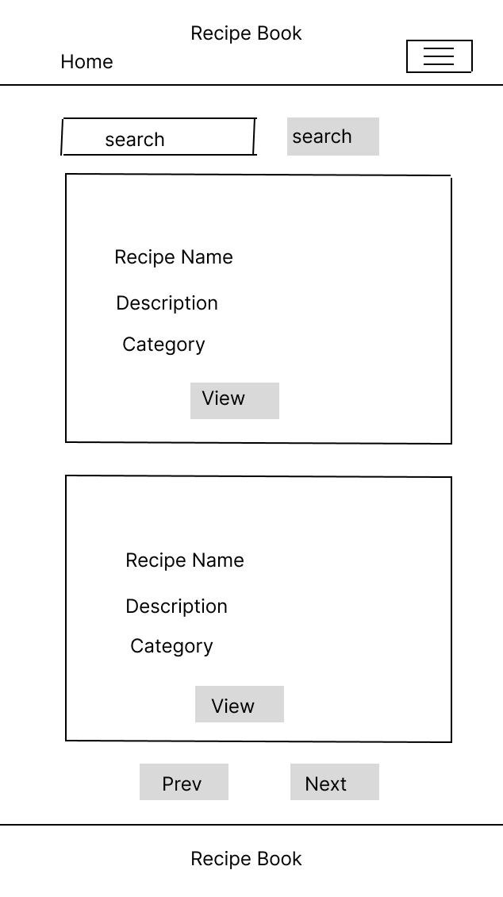
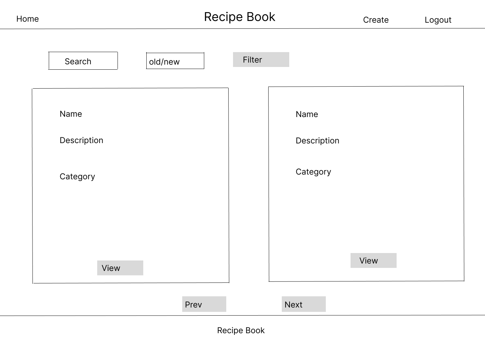
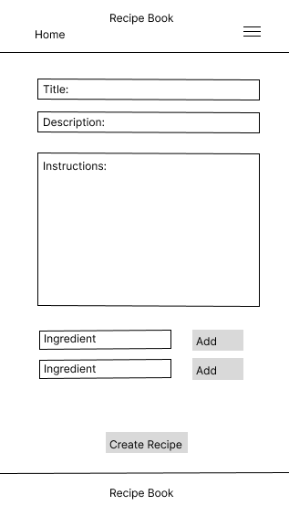
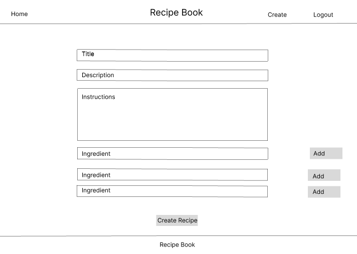

# Recipe Book

I love to cook but I am not very organised. My partner and I will search the pantry for ingredients and make a delicious meal but forget to write down the process and all of the ingredients used. A few days later I will crave this newly created dish and realise that I have forgotten the process and many of the ingredients. Damn!! I figured that if I am encountering this problem often, others are too. Recipe Book is intended to fix this problem and provide the user with the means to record, share and view all of their homemade recipes.

As a site owner, my goal is to provide a user-friendly recipe creation site. 

## Design

### Wire Frames

It was my intention to keep the design as simple as possible. Initially, the only views I envisaged were for recipe list and recipe creation. I have included wireframes for iphone and desktop for each below

- Recipe List Wireframes

- Create Recipe Wireframes

## Models

__Category__
This model is used to categorise recipes.
- Fields
  - 'name': A character field with a maximum length of 100 characters to store the category name.
- Mehtods
  - '_str_': Returns the name of the category as its string representation.

__Ingredient__
This model represents ingredients used in recipes.
- Fields
  - 'name': A character field with a maximum length of 100 characters to store the ingredient name.
- Methods
  - '_str_': Returns the name of the ingredient as its string representation.

__Recipe__
This model represents recipes and their associated details.
- Fields
  - 'title': A character field with a maximum length of 200 characters for the recipe title.
  - 'description':A character field with a maximum length of 100 characters for a brief description of the recipe.
  - 'instructions': A text field to store detailed instructions for the recipe.
  - 'user': A foreign key to the User model, indicating the user who created the recipe. If the user is deleted, all their recipes will also be deleted.
  - 'categories': A many-to-many relationship with the Category model through the RecipeCategory model, allowing a recipe to be associated with multiple categories.
  - 'ingredients': A many-to-many relationship with the Ingredient model through the RecipeIngredient model, allowing a recipe to include multiple ingredients.
  - 'created_on': A date-time field that automatically records when the recipe is created.
  - 'status': An integer field with predefined choices (defined by STATUS) to indicate the recipe's status, with a default value of 0.
- Mehtods
  - '_str_': Returns the name of the recipe as its string representation.

__RecipeIngredient__
This model serves as an intermediary to manage the many-to-many relationship between recipes and ingredients, including the quantity of each ingredient used in a recipe.
- Fields
  - 'recipe': A foreign key to the Recipe model, linking the ingredient to a specific recipe. If the recipe is deleted, the associated RecipeIngredient records will also be deleted.
  - 'ingredient': A foreign key to the Ingredient model, linking the ingredient to a specific recipe. If the ingredient is deleted, the associated RecipeIngredient records will also be deleted.
  - 'qunatity': A character field with a maximum length of 100 characters to specify the quantity of the ingredient used in the recipe.

__RecipeCategory__
This model serves as an intermediary to manage the many-to-many relationship between recipes and categories.
- Fields
  - 'recipe': A foreign key to the Recipe model, linking the recipe to a specific category. If the recipe is deleted, the associated RecipeCategory records will also be deleted.
  - 'category': A foreign key to the Category model, linking the recipe to a specific category. If the category is deleted, the associated RecipeCategory records will also be deleted.

## Existing Features

### Login

- 

### Recipe Creation

- 

__Javascript__
 - Custom script which allows users to dynamically add new ingredient forms to a formset on a webpage. When the user clicks the "Add Ingredient" button, a new form is created by cloning the first form in the set, updating its attributes to ensure uniqueness, clearing its values, and appending it to the formset.

- Event Listener for DOMContentLoaded:
   - document.addEventListener('DOMContentLoaded', function() {
    // Code here runs after the DOM is fully loaded });
 - This event listener waits for the entire HTML document to be fully loaded and parsed before executing the enclosed function. This ensures that all the DOM elements are available for manipulation.

- Select DOM Elements:
 - const addIngredientBtn = document.getElementById('add-ingredient-btn');
     - addIngredientBtn: Selects the button with the ID add-ingredient-btn which will be used to add new ingredient forms.
  - const ingredientFormset = document.querySelector('#ingredient-forms');
     - ingredientFormset: Selects the container with the ID ingredient-forms which holds the ingredient forms.
 - const totalFormsInput = document.querySelector('#id_recipeingredient_set-TOTAL_FORMS');
     - totalFormsInput: Selects the input element with the ID id_recipeingredient_set-TOTAL_FORMS, which tracks the total number of forms.

- Initial Form Count:
  - let formNum = ingredientFormset.children.length;
    - formNum: Initializes a counter to keep track of the number of existing forms. It is set to the number of children within the ingredientFormset container.

- Add Event Listener to Button:
  - addIngredientBtn.addEventListener('click', 
    function() {
    // Code here runs when the add button is clicked
    });
    - Adds a click event listener to the addIngredientBtn button. When the button is clicked, the enclosed function executes.

- Clone and Append a New Form:
  - if (ingredientFormset.children.length > 0) {
    const newForm = ingredientFormset.children[0].cloneNode(true);
    const formRegex = new RegExp(`recipeingredient_set-(\\d+)-`, 'g');
    const newFormNum = formNum;
    - Checks if there is at least one form already present in the ingredientFormset.
    - Clones the first form (index 0) inside ingredientFormset, including all its child elements, and assigns it to newForm.
    - formRegex is a regular expression that matches the pattern recipeingredient_set- followed by any digits (the current form number).
    - newFormNum is assigned the current value of formNum.

- Update the Cloned Form's Attributes
  - newForm.innerHTML = newForm.innerHTML.replace(formRegex, `recipeingredient_set-${newFormNum}-`);
    - Replaces all occurrences of the pattern recipeingredient_set- followed by digits in the innerHTML of the cloned form with recipeingredient_set- followed by the new form number. This ensures that the form fields have unique names and IDs.
  
  - newForm.querySelectorAll('[id]').forEach(function   (element) {
    const newId = element.id.replace(formRegex, `recipeingredient_set-${newFormNum}-`);
    element.id = newId;
    });
    - Finds all elements in the cloned form that have an id attribute and Updates each id attribute to use the new form number, ensuring uniqueness.
  
  - newForm.querySelectorAll('[name]').forEach(function(element) {
    const newName = element.name.replace(formRegex, `recipeingredient_set-${newFormNum}-`);
    element.name = newName;
    });
    - Finds all elements in the cloned form that have a name attribute and updates each id attribute to use the new form number, ensuring uniqueness.

- Clear Values in Cloned Form
  - newForm.querySelectorAll('input, select, textarea').forEach(function(element) {
    if (element.type === 'checkbox' || element.type === 'radio') {
        element.checked = false;
        } else {
        element.value = '';
        }
      });
      - Selects all input, select, and textarea elements within the cloned form and clears their values. If the element is a checkbox, it unchecks it.

- Append the Cloned Form and Update Total Forms
  - ingredientFormset.appendChild(newForm);
    formNum++;
    totalFormsInput.value = formNum;
    - Appends the cloned and modified form (newForm) to the ingredientFormset. Increments the formNum counter. Updates the value of the totalFormsInput to reflect the new total number of forms.

### Recipe Editing

### Recipe Deletion

### Other

- Pagination
- Search / Filter
- Header / Footer

### Additional features
- add quantities model
- Add other
- improve ingredient selection

## Testing

### Testing Table

| Action    | Expectation | Result | 
| ---------|:-------------------:|----------|
| update | update | update |

### Validator Testing
- __HTML__
  - No errors returend through W3C validator.

- __CSS__
  - No errors returned through jigsaw validator.

- __JS__
  - No errors returned through jshint validator.

- __Python__
  - No errors returned through PEP8 CI Python Linter.

### Unfixed Bugs
- __TBU__
  - blurb

## Deployment

- The site was deployed to GitHub pages. The steps to deploy are as follows:
  - In the GitHub repository, navigate to the Settings tab
  - From the source section drop-down menu, select the Master Branch
  - Once the master branch has been selected, the page will be automatically refreshed with a detailed ribbon display to indicate the successful deployment.

- Cloning and forking

- The live link can be found here: